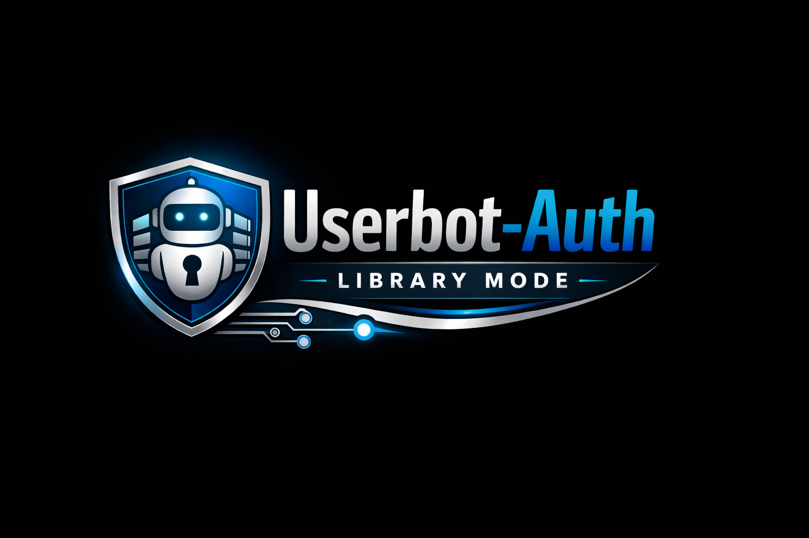

# 🛡️ Userbot-Auth Library Mode




## ✨ Features

Userbot-Auth Library Mode is a **server-enforced authentication and control layer** for userbots. It is designed to keep authority on the backend, not inside copied client code.

## Getting Started
```py
# Add __init__.py or You can add files

import os
from userbot_auth import UserbotAuth

ubt = UserbotAuth(
    url="https://your-domain.com",
    secret=os.getenv("UBT_SECRET") or "",
    token=os.getenv("UBT_PROVISION_TOKEN"),
    strict=True,
)

inst = await ubt.now_install(123456789)
if not inst.get("ok"):
    raise RuntimeError(f"INSTALL_FAILED: {inst}")

jx = await ubt.check(123456789, {
    "first_name": "",
    "phone_number": "",
})
if not (isinstance(jx, dict) and isinstance(jx.get("data"), dict) and jx["data"].get("ok")):
    status = jx.get("data", {}).get("status")
    if status == "BANNED":
        raise RuntimeError("DEPLOY_BLOCKED_BY_SERVER")
    raise RuntimeError(f"PING_FAILED: {jx}")

btt = await ubt.log_update(
    user_id=123456789,
    first_name="",
    phone_number="",
    version="2026",
    device="",
    system="",
    platform="",
)
if not (isinstance(btt.get("data"), dict) and btt["data"].get("ok")):
    status = btt.get("data", {}).get("status")
    if status == "BANNED":
        raise RuntimeError("DEPLOY_BLOCKED_BY_SERVER")
    raise RuntimeError(f"DEVICES_FAILED: {btt}")

# Your code here

await ubt.aclose()
```

## Feature Highlights

### 🔐 **Server-Issued Runtime Keys**
All runtime access is controlled by server-generated keys bound to a specific user identity.

### 🛑 **Deploy Control & Remote Blocking**
Deployments can be disconnected or blocked remotely, even if client code is copied or modified.

### 🔄 **Key Rotation & Revocation**
Runtime keys can be rotated at any time to invalidate existing deployments instantly.

### 📊 **Plan-Based Rate Limiting**
Request limits are enforced by server-defined plans (FREE / PRO / MAX) with optional per-user overrides.

### 🕶️ **One-Time Key Exposure**
Runtime keys are shown only once during issuance to reduce leakage risk.

### 📝 **Audit-Friendly Key Issuance**
Every issued key includes a unique `issued_id` for tracking, review, and incident response.

### 🔒 **Hardened Request Validation**
Supports timestamp checks, nonce-based HMAC signatures, and timing-safe comparisons.

### 🏛️ **Centralized Enforcement**
All authorization decisions are made on the backend, not in client code.

### ⚡ **Anti-Reuse & Anti-Repack Design**
Copied source code cannot bypass server validation or rate limits.

### 📚 **Library-First Architecture**
Designed to integrate cleanly into existing userbot frameworks or backend services without lifecycle coupling.

## 🔑 Authentication and Identity

- **Server-issued runtime keys** (`ubt_live_*`, optional `ubt_test_*`)
  Keys are issued by the server and verified on every request.

- **Per-user identity binding**
  Every key is associated with a specific `user_id`. The server decides whether that identity is valid.

- **Strict separation of secrets**
  Provisioning secrets and runtime keys are isolated to prevent privilege escalation.

---

## ⚙️ Provisioning and Key Control

- **Controlled key provisioning**
  Runtime keys can only be issued through a protected provision flow.

- **Key rotation and revocation**
  Keys can be rotated to invalidate old deployments immediately.

- **One-time key visibility**
  Runtime keys are displayed once during issuance to reduce leakage risk.

- **Audit identifiers (`issued_id`)**
  Every issued key can be traced and reviewed through an audit-friendly identifier.

## ⚡ Runtime Enforcement

- **Connected-user verification**
  Requests are accepted only when the server confirms the user is connected and authorized.

- **Remote deploy blocking**
  The server can block deployments at runtime (disconnect or ban), regardless of client code.

- **Automatic disconnect on invalid credentials**
  Invalid keys or mismatched identity triggers server-side disconnect logic.

## 📈 Plan System and Rate Limiting

- **Plan-based limits**
  Traffic limits are enforced by plan tiers (FREE / PRO / MAX).

- **Per-user overrides**
  Limits can be customized per user (including unlimited access for trusted accounts).

- **Server-side rate enforcement**
  Limits cannot be bypassed by modifying client code, because counters and windows live on the server.

- **Consistent 429 responses with reset metadata**
  The API can return retry timing information for clean client backoff behavior.

## 🔐 Security Hardening

- **Timestamp freshness validation**
  Prevents delayed or replayed requests outside allowed time skew.

- **Nonce-based request signing (HMAC)**
  Provides integrity checks and replay resistance for sensitive endpoints.

- **Replay protection strategy**
  Requests can be rejected if a nonce is reused within a time window.

- **Timing-safe comparisons**
  Protects secret comparisons from timing-based attacks.

## Operational Visibility

- **Deployment and runtime telemetry**
  The server can track version, platform, device, and last-seen activity.

- **Actionable status responses**
  Standardized responses for states like `DISCONNECTED`, `BANNED`, and `RATE_LIMIT`.

- **Central enforcement policies**
  Your backend defines enforcement rules, and the library ensures they are applied consistently.

## Intended Use

- 🔒 Private userbot frameworks
- 💼 Commercial or restricted deployments
- 🛡️ Projects requiring deploy control and anti-reuse enforcement
- 👨‍💻 Developers who need server authority and auditability
